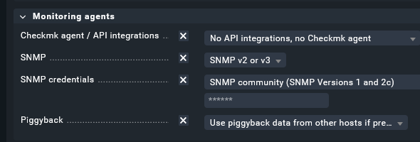
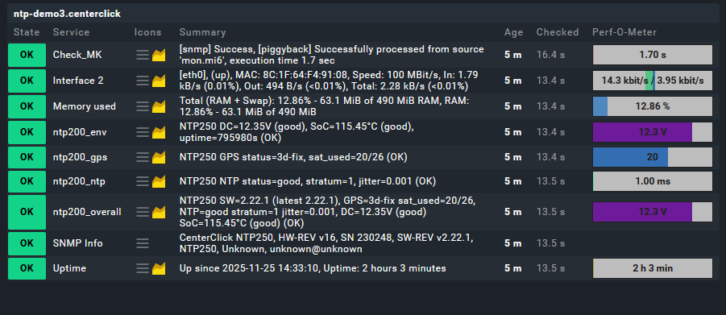
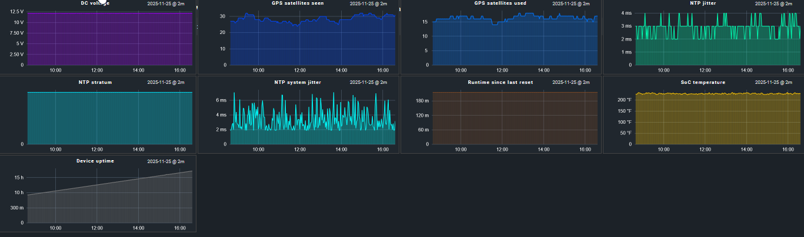

# NTP200-checkmk

[CenterClick NTP200 - NTP250](https://centerclick.com/ntp/docs/hardware_200_250) CheckMK monitoring scripts.  These should also work with the new [NTP250/270](https://centerclick.com/ntp/docs/hardware_220_270) devices as well.  This is a piggy back script that grabs the json via http and parses it from the servers local check_mk agent.  The use of piggyback data allows the ability to still ping/define the device as a host but collect the json data via the server.  

Recomend also turning on SNMP on the NTP200 as that will allow monitoring/checking of the network interface, ram used, and device uptime.

From the JSON data we do warn/crit on board temp, ntp jitter, and stratum level.   We then graph DC Voltage, SoC Temp, GPS Sats seen/Used, NTP Jitter, NTP stratum, and device uptime.

# Steps to install

 1. Place ntp200_metrics.py
 2. Place ntp200_perfometers.py
 3. Restart the GUI once these files are placed.  omd restart sitename
 4. Place/Edit ntp200_piggyback.py
 5. chmod +x ntp200_piggyback.py
 6. Add host in WATO.  Make sure to enable the piggyback for the host.

ntp200_metrics.py needs to go into your /omd/sites/sitename/share/check_mk/web/plugins/metrics/ folder
ntp200_perfometers.py needs to go into your /omd/sites/sitename/share/check_mk/web/plugins/perfometer/ folder
ntp200_piggyback.py goes into /usr/lib/check_mk_agent/local/ folder

Inside the ntp200_piggyback.py file you need to define your hosts and URL's for the JSON.

	# NTP200 endpoints (hostname here must match Checkmk host name!)
	DEVICES  = [
	{"name": "ntp-demo3.centerclick", "url": "http://ntp-demo3.centerclick.com/json"},
	{"name": "clock2.host", "url": "http://clock2/json"},
	{"name": "clock3.host", "url": "http://clock3/json"},
	]

You can also change the default warn/crit settings if you like in that file as well.

Make sure piggy back is checked when adding the host:

# Screenshots

